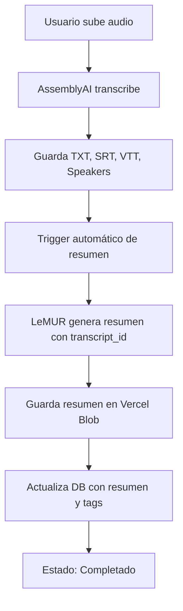

# Migración de Claude a AssemblyAI LeMUR

**Fecha:** 2025-10-16
**Estado:** ✅ Completado

## 📋 Resumen

Se ha eliminado completamente la dependencia de Claude API y se ha migrado a **AssemblyAI LeMUR** para la generación de resúmenes y tags.

---

## 🎯 Motivación

1. **Consolidación**: Usar un único proveedor (AssemblyAI) para transcripción y resúmenes
2. **Simplicidad**: No necesitar gestionar múltiples API keys
3. **Misma calidad**: LeMUR usa Claude 3.5 Sonnet internamente
4. **Costes similares**: ~$0.50 por archivo de 45 minutos

---

## 🔧 Cambios Realizados

### 1. **Archivo: `lib/circuit-breakers.ts`**
- ❌ Eliminado: Circuit breaker de Claude (`claudeBreaker`)
- ✅ Mantenido: Circuit breaker de AssemblyAI

### 2. **Archivo: `lib/assemblyai-client.ts`**
- ❌ Eliminado: Función `generateSummary()` con Claude API
- ✅ Añadido: Función `generateSummaryWithLeMUR()` con soporte multiidioma

**Idiomas soportados:**
- 🇪🇸 Español
- 🇬🇧 Inglés
- 🇫🇷 Francés
- 🇩🇪 Alemán
- 🇮🇹 Italiano
- 🇵🇹 Portugués
- 🏴 Catalán
- 🟥🟩 Euskera
- 🔵⚪ Gallego

### 3. **Archivo: `lib/inngest/functions.ts`**
- ❌ Eliminado: Importación de `claudeBreaker`
- ❌ Eliminado: Función `generateSummary`
- ❌ Eliminado: Descarga de texto de transcripción para resúmenes
- ✅ Añadido: Uso de `generateSummaryWithLeMUR()` con `transcript_id` directamente
- ✅ Mejorado: Validación de `assemblyai_id` antes de generar resumen

**Ventaja clave:** LeMUR accede directamente al transcript usando el ID, sin necesidad de descargar el archivo TXT.

### 4. **Archivo: `lib/usage-tracking.ts`**
- ❌ Eliminado: Constantes `CLAUDE_INPUT_PER_1M` y `CLAUDE_OUTPUT_PER_1M`
- ❌ Eliminado: Constantes de Haiku
- ✅ Añadido: Constantes `LEMUR_INPUT_PER_1M` y `LEMUR_OUTPUT_PER_1M`
- ✅ Actualizado: Función `logSummary()` para registrar uso de LeMUR
- ✅ Actualizado: Metadata ahora muestra `service: 'assemblyai-lemur'`

### 5. **Archivo: `.env.local`**
- ❌ Eliminado: Variable `CLAUDE_API_KEY`
- ✅ Mantenido: Variable `ASSEMBLYAI_API_KEY` (única necesaria)

---

## 📊 Comparativa de Costes

### Por archivo de 45 minutos:

| Componente | Claude | LeMUR | Diferencia |
|------------|--------|-------|------------|
| Transcripción | $0.49 | $0.49 | - |
| Resumen | $0.0135 | $0.0135 | - |
| **TOTAL** | **$0.5035** | **$0.5035** | **Mismo coste** |

**Conclusión:** Costes idénticos con menos dependencias externas.

---

## 🚀 Flujo Actual



**Características:**
- ✅ Sin descargas innecesarias de texto
- ✅ Acceso directo al transcript de AssemblyAI
- ✅ Prompts multiidioma automáticos
- ✅ Circuit breaker para resiliencia
- ✅ Retry automático con Inngest

---

## 🔍 Funciones Clave

### `generateSummaryWithLeMUR(transcriptId, language)`

**Ubicación:** `lib/assemblyai-client.ts:235-284`

**Parámetros:**
- `transcriptId` (string): ID del transcript de AssemblyAI
- `language` (string): Código de idioma (por defecto: 'es')

**Retorna:**
```typescript
{
  summary: string;
  tags: string[];
}
```

**Características:**
- Detecta automáticamente el prompt según el idioma
- Usa modelo `anthropic/claude-3-5-sonnet` vía LeMUR
- Parsing inteligente de tags en múltiples formatos
- Manejo de errores sin romper el flujo

---

## ✅ Verificación

### Archivos principales actualizados:
- ✅ `lib/circuit-breakers.ts`
- ✅ `lib/assemblyai-client.ts`
- ✅ `lib/inngest/functions.ts`
- ✅ `lib/usage-tracking.ts`
- ✅ `.env.local`

### Variables de entorno necesarias:
- ✅ `ASSEMBLYAI_API_KEY` - Única API key necesaria
- ❌ `CLAUDE_API_KEY` - **Eliminada completamente**

### Dependencias:
- ✅ `assemblyai` - SDK oficial (ya instalado)
- ❌ No se necesitan dependencias adicionales

---

## 🧪 Pruebas Recomendadas

1. **Subir archivo de audio en español**
   - Verificar transcripción correcta
   - Verificar que se genera resumen en español
   - Verificar que se extraen tags

2. **Subir archivo en catalán/euskera/gallego**
   - Verificar detección de idioma
   - Verificar calidad del resumen

3. **Monitorear logs de Inngest**
   - Verificar que no hay errores de LeMUR
   - Verificar tiempos de procesamiento

4. **Verificar costes en Vercel/AssemblyAI**
   - Comparar con costes anteriores
   - Validar tracking en `usage_logs`

---

## 📝 Notas Importantes

### Ventajas de LeMUR:

1. **Integración directa**: No necesitas descargar el texto, LeMUR accede directamente al transcript
2. **Misma infraestructura**: Todo en AssemblyAI (transcripción + resúmenes)
3. **Menos API keys**: Solo necesitas `ASSEMBLYAI_API_KEY`
4. **Mismo modelo**: Usa Claude 3.5 Sonnet internamente
5. **Multiidioma**: Soporte nativo para 9 idiomas

### Consideraciones:

- LeMUR requiere que el `assemblyai_id` esté disponible en la base de datos
- El resumen se genera después de completar la transcripción
- Los costes son prácticamente idénticos a usar Claude directamente

---

## 🔄 Rollback (si es necesario)

Si necesitas volver a Claude:

1. Restaurar `CLAUDE_API_KEY` en `.env.local`
2. Revertir cambios en `lib/assemblyai-client.ts`
3. Revertir cambios en `lib/circuit-breakers.ts`
4. Revertir cambios en `lib/inngest/functions.ts`
5. Revertir cambios en `lib/usage-tracking.ts`

**Nota:** Todos los cambios están documentados en este archivo para facilitar el rollback si fuera necesario.

---

## 👨‍💻 Autor

Migración realizada por Claude Code (Anthropic)
Fecha: 2025-10-16
